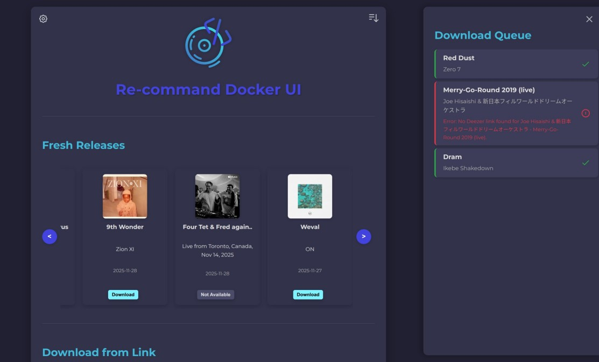
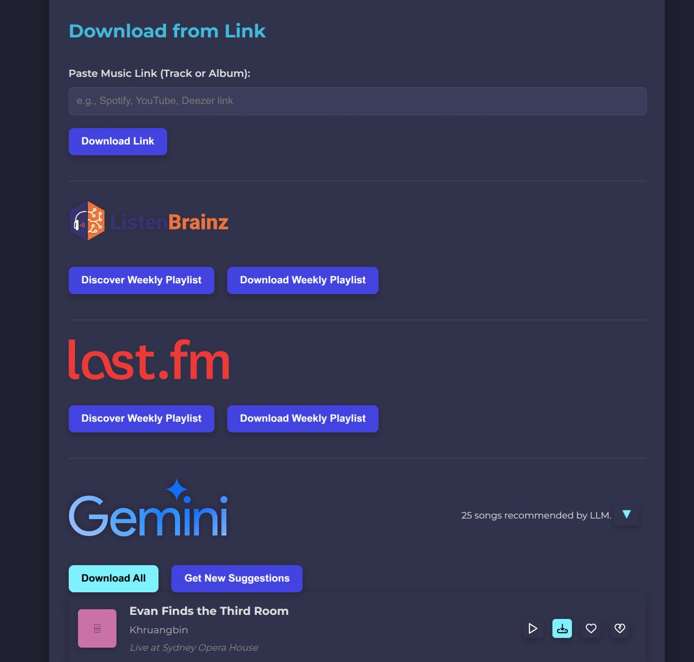
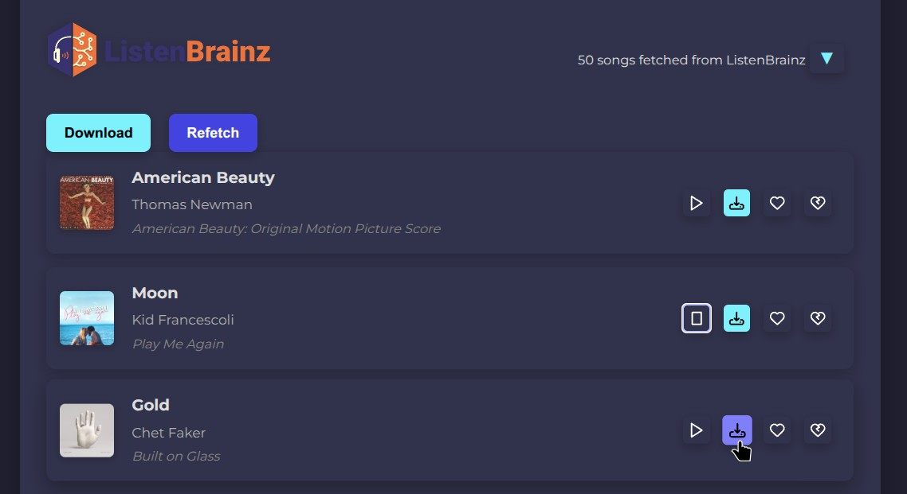
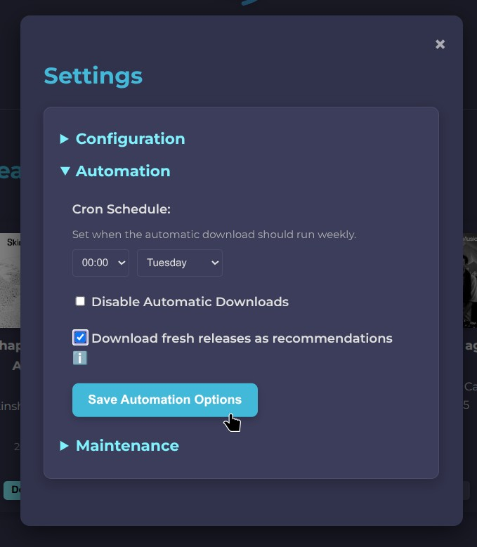

# TrackDrop

<p align="center">
  
</p>

A modern, containerized music discovery and download system for Navidrome. TrackDrop automatically discovers and downloads music recommendations from [ListenBrainz](https://listenbrainz.org), [Last.fm](https://www.last.fm), and AI-powered LLM suggestions using [Streamrip](https://github.com/nathom/streamrip) or [Deemix](https://deemix.org/), then organizes and tags them in your music library.

## Credits

TrackDrop is a fork of [re-command](https://github.com/Snapyou2/re-command) by Snapyou2. This project extends the original with significant new features and improvements.

### Features Added in This Release

- **iOS Shortcuts Integration** - Quick download links from iOS via the Shortcuts app with secure API key authentication
- **PWA Share Target** - Share music links directly from Android apps to TrackDrop via the installed Progressive Web App
- **YouTube Link Downloads** - Automatic YouTube audio fallback when tracks aren't found on streaming services, with oEmbed title parsing
- **Album-Aware Duplicate Detection** - Smarter duplicate checking that considers artist, title, AND album to avoid false positives
- **Spotify Metadata Verification** - Validates Songlink results against Spotify metadata before downloading
- **Per-User Download Queue** - Each user sees only their own downloads, sorted by most recent first
- **Real-Time Track Display** - Shows track names and progress in the download queue instead of generic messages
- **Mobile-Optimized Login** - Responsive login page that works perfectly on phones without scrolling
- **First-Time Setup Wizard** - Guided setup for new users including mobile app integration instructions
- **Configurable Timezone** - Per-user cron schedules with timezone support (default: Monday midnight US/Eastern)

## Key Features

### Core Features
- **Multi-Source Recommendations** - Automatically fetch weekly recommendations from ListenBrainz, Last.fm, or LLM-powered suggestions
- **Lossless Downloads** - Download FLAC quality music via Streamrip (Deezer) or Deemix
- **Smart Organization** - Automatic Artist/Album folder structure with full metadata tagging
- **Navidrome Integration** - Seamless integration with Navidrome's Subsonic API for playlist management
- **Web UI** - Modern, responsive web interface for configuration and monitoring

### Download & Link Sharing
- **Universal Link Downloads** - Share music links from Spotify, Deezer, Tidal, YouTube, Apple Music, SoundCloud, and more
- **Playlist Downloads** - Download entire playlists from Spotify, Deezer, Tidal, and YouTube
- **PWA Share Target** - Share links directly from Android apps to TrackDrop
- **iOS Shortcuts Integration** - Quick download from iOS with API key authentication
- **YouTube Fallback** - Automatic YouTube audio download when tracks aren't found on streaming services
- **Songlink/Odesli Integration** - Automatic cross-platform link resolution

### Smart Duplicate Detection
- **Album-Aware Matching** - Prevents downloading duplicate tracks by checking artist, title, AND album
- **Multi-Source Verification** - Verifies Songlink results against Spotify metadata before downloading
- **Navidrome Library Check** - Searches existing library before downloading to avoid duplicates

### User Experience
- **Per-User Download Queue** - Each user sees only their own downloads, sorted by most recent
- **Track Progress Display** - Real-time progress with track names and status for playlist downloads
- **Mobile-Optimized Interface** - Responsive design that works great on phones and tablets
- **First-Time Setup Wizard** - Guided setup for new users including mobile app integration
- **Multi-User Support** - Per-user settings, schedules, and download history

### Playlist Management
- **API Playlist Mode** - Manage playlists via Navidrome's Subsonic API
- **Tags Mode** - Legacy smart playlists via metadata comments
- **Playlist Monitoring** - Auto-sync external playlists on a schedule
- **Rating-Based Cleanup** - Automatically remove low-rated tracks, keep favorites

### Scheduling & Automation
- **Per-User Cron Schedules** - Each user can set their own weekly recommendation schedule
- **Timezone Support** - Set schedules in your local timezone (default: Monday midnight US/Eastern)
- **Automatic Library Scans** - Trigger Navidrome library scans after downloads

## Quick Start

### Docker Compose (Recommended)

1. Download the docker-compose.yml:
```bash
wget https://raw.githubusercontent.com/B1naryShad0w/trackdrop/main/docker/docker-compose.yml
```

2. Edit the file and set at least the volumes to your Navidrome music library path:
```yaml
volumes:
  - /path/to/your/music:/app/music
  - /path/to/your/music/.tempfolder:/app/temp_downloads
  - ./data:/app/data
```

3. Create a `.env` file with your configuration:
```env
# Navidrome settings (can also be configured via web UI)
TRACKDROP_ROOT_ND=http://your-navidrome-server:4533
TRACKDROP_USER_ND=your_username
TRACKDROP_PASSWORD_ND=your_password

# Deezer ARL for downloads
TRACKDROP_DEEZER_ARL=your_deezer_arl

# Optional: ListenBrainz
TRACKDROP_LISTENBRAINZ_ENABLED=true
TRACKDROP_TOKEN_LB=your_listenbrainz_token
TRACKDROP_USER_LB=your_listenbrainz_username

# Optional: Last.fm
TRACKDROP_LASTFM_ENABLED=true
TRACKDROP_LASTFM_USERNAME=your_lastfm_username
TRACKDROP_LASTFM_API_KEY=your_api_key
TRACKDROP_LASTFM_API_SECRET=your_api_secret

# Optional: Spotify (for playlist extraction)
TRACKDROP_SPOTIFY_CLIENT_ID=your_spotify_client_id
TRACKDROP_SPOTIFY_CLIENT_SECRET=your_spotify_client_secret
```

4. Start the container:
```bash
docker compose up -d
```

5. Access the web UI at `http://localhost:5000` and log in with your Navidrome credentials.

## Configuration

### Environment Variables

| Variable | Description |
|----------|-------------|
| `TRACKDROP_ROOT_ND` | Navidrome server URL |
| `TRACKDROP_USER_ND` | Navidrome username |
| `TRACKDROP_PASSWORD_ND` | Navidrome password |
| `TRACKDROP_DEEZER_ARL` | Deezer ARL token for downloads |
| `TRACKDROP_DOWNLOAD_METHOD` | `streamrip` (default) or `deemix` |
| `TRACKDROP_LISTENBRAINZ_ENABLED` | Enable ListenBrainz recommendations |
| `TRACKDROP_TOKEN_LB` | ListenBrainz API token |
| `TRACKDROP_USER_LB` | ListenBrainz username |
| `TRACKDROP_LASTFM_ENABLED` | Enable Last.fm recommendations |
| `TRACKDROP_LASTFM_USERNAME` | Last.fm username |
| `TRACKDROP_LASTFM_API_KEY` | Last.fm API key |
| `TRACKDROP_LASTFM_API_SECRET` | Last.fm API secret |
| `TRACKDROP_LASTFM_SESSION_KEY` | Last.fm session key |
| `TRACKDROP_LLM_ENABLED` | Enable LLM-powered recommendations |
| `TRACKDROP_LLM_PROVIDER` | LLM provider: `gemini`, `openrouter`, or `llama` |
| `TRACKDROP_LLM_API_KEY` | LLM API key |
| `TRACKDROP_LLM_MODEL_NAME` | LLM model name |
| `TRACKDROP_SPOTIFY_CLIENT_ID` | Spotify Client ID (for playlist extraction) |
| `TRACKDROP_SPOTIFY_CLIENT_SECRET` | Spotify Client Secret |
| `TRACKDROP_PLAYLIST_MODE` | `tags` (metadata) or `api` (Subsonic API playlists) |
| `TRACKDROP_ADMIN_USER` | Admin username for library scans |
| `TRACKDROP_ADMIN_PASSWORD` | Admin password for library scans |
| `TRACKDROP_NAVIDROME_DB_PATH` | Path to Navidrome's database (read-only, for rating checks) |
| `TRACKDROP_SECRET_KEY` | Flask session secret key (auto-generated if not set) |

### Playlist Mode

**Tags Mode (default):** Creates smart playlists via metadata comments. Navidrome automatically creates playlists based on comment tags.

**API Mode:** Manages playlists directly via Navidrome's Subsonic API. Set `TRACKDROP_PLAYLIST_MODE=api` to enable.

### LLM Recommendations

TrackDrop supports AI-powered music recommendations. Recommended providers:
- **Gemini** - Free tier available, excellent results with `gemini-2.5-flash`
- **OpenRouter** - Access to various models including free options
- **Llama** - Self-hosted local LLM support

## Mobile Integration

### Android (PWA Share Target)

1. Open TrackDrop in Chrome/Edge
2. Tap the menu and select "Install app" or "Add to Home screen"
3. Share any music link from apps like Spotify, YouTube, etc. and select TrackDrop

### iOS (Shortcuts)

1. Go to Settings > Mobile Apps in TrackDrop
2. Generate an API key
3. Follow the instructions to set up the iOS Shortcut
4. Share any music link and select the TrackDrop shortcut

## CLI Usage

```bash
# Download recommendations from all enabled sources
python trackdrop.py

# Download from specific source
python trackdrop.py --source listenbrainz
python trackdrop.py --source lastfm
python trackdrop.py --source llm

# Download fresh releases albums
python trackdrop.py --source fresh_releases

# Run cleanup (process ratings and delete low-rated tracks)
python trackdrop.py --cleanup

# Bypass playlist change check (force download)
python trackdrop.py --bypass-playlist-check

# Specify user for per-user history tracking
python trackdrop.py --user myusername
```

## Screenshots






## Troubleshooting

### Common Issues

- **Deezer downloads failing:** Check that your ARL is valid and not expired
- **Navidrome connection errors:** Verify the server URL and credentials
- **Library scan not working:** Ensure admin credentials are configured for API mode
- **Tracks not appearing in playlists:** Wait for the library scan to complete

### Logs

```bash
docker logs trackdrop
```

## License

MIT License - See LICENSE file for details.

## Contributing

Contributions are welcome! Please open an issue or submit a pull request.
