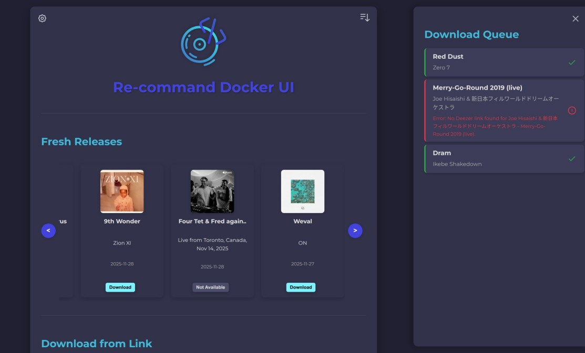
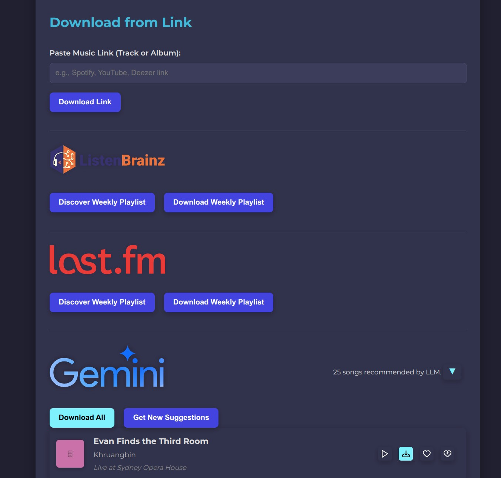
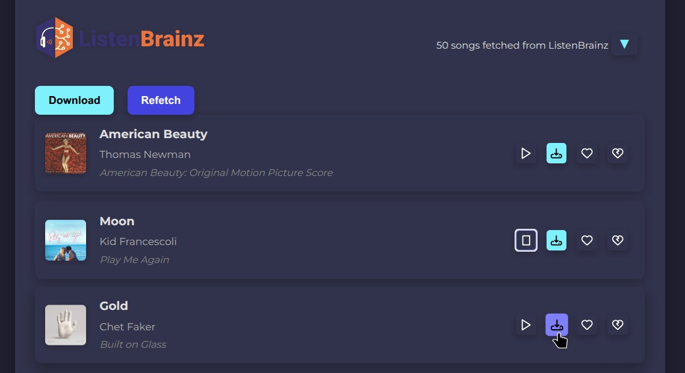
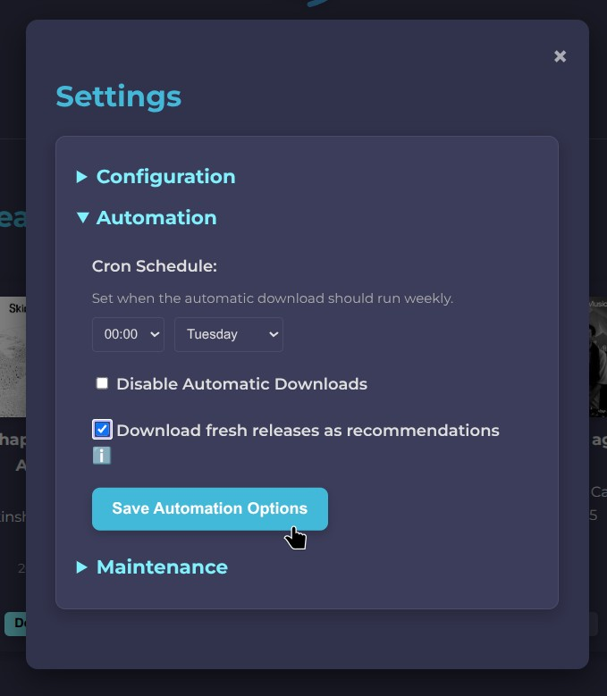

# re-command: Automated music recommendation system for Navidrome

<p align="center">
  
</p>

> 🌟 **Thank you for 100 stars!** Experimental Soulseek P2P integration has been added! Download & share thanks to the community-powered network.

`re-command` is a modern, containerized music recommendation and automation system that enhances your Navidrome music experience. It automatically discovers and downloads music recommendations from [ListenBrainz](https://listenbrainz.org) and [Last.fm](https://www.last.fm) using [Streamrip](https://github.com/nathom/streamrip), [Deemix](https://deemix.org/), or [Soulseek P2P](https://github.com/JurgenR/aioslsk), then organizes and tags them in your music library.

## Key features

*   **Multi-source recommendations:** Fetches music recommendations playlists from ListenBrainz, Last.fm, and LLM-powered suggestions (gemini/openrouter/llama.cpp). Includes a built-in cron scheduling for weekly automated downloads
*   **Triple download methods:** Supports Streamrip v2, Deemix (both via Deezer), and Soulseek P2P for community-shared music with a higher catalog coverage
*   **Persistent download queue:** Soulseek downloads run in a background queue with a persistent connection, no reconnect overhead per track. Configurable keep-alive, FLAC-only mode, and music library sharing
*   **Fresh releases discovery:** Automatically shows newly released albums from ListenBrainz with a quick download button
*   **Universal link downloads:** Download music straight to your sever with Spotify, YouTube, Deezer, and other platforms links using Songlink API integration (still in beta)
*   **Track previews & feedback:** Preview tracks before downloading and submit feedback manually to ListenBrainz/Last.fm
*   **Dynamic playlist support:** Downloaded tracks are tagged with configurable comment markers for dynamic playlists
*   **Automated library maintenance:** Removes tracks from previous recommendations and submit scrobbling feedbacks based on your Navidrome ratings
*   **Containerized deployment:** Full Docker support with automated setup and configuration

## Table of contents

- [Prerequisites](#prerequisites)
- [Quick start with Docker compose image](#quick-start-with-docker-compose-image)
- [Screenshots](#screenshots)
- [Usage modes](#usage-modes)
- [Manual configuration](#manual-configuration)
- [LLM model comparison](#llm-model-comparison)
- [Advanced configuration](#advanced-configuration)
- [Troubleshooting](#troubleshooting)
- [Contributing / roadmap](#contributing--roadmap)

## Prerequisites

- [Docker](https://www.docker.com/get-started) and [Docker Compose](https://docs.docker.com/compose/) installed
- A running [Navidrome](https://www.navidrome.org/) instance
- A [ListenBrainz](https://listenbrainz.org/) account for ListenBrainz recommendations, fresh releases and LLM playlists

Optional (at least one download source required)
- [Deezer](https://www.deezer.com/) account with ARL token (for Streamrip/Deemix)
- [Soulseek](https://www.slsknet.org/) account (free registration, no email required)
- A [Last.fm API account](https://www.last.fm/api/account/create) for Last.fm recommendations
- A LLM API key or base URL for llama.cpp for LLM recommendations

## Quick start with Docker compose image

### 1. Download only the docker.yml 

```bash
wget https://raw.githubusercontent.com/Snapyou2/re-command/refs/heads/main/docker/docker-compose.yml

```

Edit the file and set at least the volumes to your Navidrome music library path. Replace the whole "{MUSIC_PATH:-../music}" with the full library path.
It should look like this:
```
    volumes:
      - /home/snapyou2/Music:/app/music
      - /home/snapyou2/Music/.tempfolder:/app/temp_downloads
```

### 2. Start the application

```bash
docker compose up -d
```

### 3. Access the web interface

Open `http://localhost:5000` in your browser. Configure Navidrome access, playlist providers, and Deezer ARL in the settings. You can also click the "Create Smart Playlists" after you configured everything and then trigger a rescan of your Navidrome library.

## Screenshots









## Usage modes

### 1. Automated weekly downloads

Runs automatically every Tuesday at 00:00 (configurable) via cron job. The process runs in two phases:

**Phase 1: Library cleanup & feedback**
- Scans your Navidrome library for tracks with recommendation comments
- **1 star**: Sends negative feedback and deletes the track
- **2-3 stars**: Deletes the track (no feedback)
- **4 stars**: Keeps the track and removes the recommendations comment (no feedback, but out of your dynamic playlist)
- **5 stars**: Sends positive feedback, keeps the track and removes the recommendation comment
- Feedback is submitted to ListenBrainz and Last.fm based on your ratings

**Phase 2: Download new recommendations**
- Fetches new recommendations from ListenBrainz, Last.fm and/or LLM playlists (based on what is enabled)
- Downloads and tags new tracks using Streamrip, Deemix, or Soulseek P2P
- Soulseek downloads use a persistent client connection across the batch (no reconnect per track)
- Organizes downloaded music into path/artist/album/track

### 2. Fresh releases discovery

Discovery of newly released albums:
- Fetches from ListenBrainz fresh releases API each time you load the web page
- Displays last 10 albums with album art
- Allows selective downloading (only for one week if set up in the settings)
- Organizes into music library

### 3. Link downloads

Download music from any supported platform:
- Paste a music link from your favorite music app and get them downloaded on your server using Songlink API. Links supported by service :
  - Spotify : tracks/albums
  - Deezer : tracks/albums
  - Apple music : tracks/albums
  - Tidal : tracks/albums
  - Youtube Music : tracks/some playlists
  - Amazon Music : very experimental

### 4. Soulseek P2P downloads

Soulseek is a peer-to-peer network where users share music files directly. It offers an alternative to Deezer (user-contributed, rare/obscure tracks), often with high res audio, with no subscription required.

**How it works:**
- Select "Soulseek" as the download method in settings
- Enter a Soulseek username and password
- When you click download on a track, it's added to a **persistent background queue**
- A single Soulseek client connection is maintained across all downloads (no reconnect per track)
- Files are saved to `/app/temp_downloads/` and then organized to `/app/music/`

**Per-track timeout:** The search phase has a timeout of `search_timeout + 5` seconds (~20s by default). If no results are found within that window, the track is skipped and the next one starts. Once a download begins, the transfer can take up to 5 minutes to complete.

**Soulseek options:**

| Setting | Default | Description |
|---------|---------|-------------|
| Keep client always on | On | Keeps the Soulseek connection alive between downloads. If off, disconnects after 30s of idle |
| Minimum quality | 128 kbps | Slider: 128kbps, 192kbps, 320kbps, or Lossless (FLAC only). Results below the threshold are filtered out |
| Share music library | Off | Shares `/app/music/` with other Soulseek peers. Be careful about other files you could have in this directory, they will be accessible by anyone. |
| Search timeout | 15s | How long to wait for search results before picking the best match |

**Network configuration for sharing:**

The Soulseek client listens on TCP ports `60000` (standard) and `60001` (obfuscated). These ports are exposed in the default `docker-compose.yml`. You must also open them in your firewall/cloud security group:

```bash
# UFW
sudo ufw allow 60000/tcp comment 'Soulseek'
sudo ufw allow 60001/tcp comment 'Soulseek Obfuscated'

# OCI / AWS / GCP: Add ingress rule for TCP 60000-60001 from 0.0.0.0/0
```

**Note:** The Soulseek protocol uses the server-side observed IP, not the container's internal IP. Bridge networking with port mapping works identically to `--network host`, a custom bridge network is used by default in `docker-compose.yml`.

### 5. Individual track downloads from recommendation playlists

Via web interface:
- Preview tracks before downloading (30-second previews)
- Download individual tracks from recommendations
- Submit manual like/dislike feedback to the playlist provider (defaults to ListenBrainz for LLM playlists)

### 6. Library maintenance

Cleans up your music library based on ratings (done automatically with the cron job but can be manually triggered in the settings):
- Automatically removes tracks rated 3 stars or below
- Submits feedback to ListenBrainz for disliked tracks
- Clears recommendation tags from highly rated tracks

### 7. Manual control

Via web interface or command line:
```bash
# Download only ListenBrainz recommendations
python re-command.py --source listenbrainz

# Download only Last.fm recommendations
python re-command.py --source lastfm

# Download only LLM recommendations
python re-command.py --source llm

# Download all available fresh releases
python re-command.py --source fresh_releases

# Run library cleanup based on ratings
python re-command.py --cleanup

# Bypass playlist change detection for Listenbrainz (redownload a playlist previously downloaded)
python re-command.py --bypass-playlist-check
```

## Manual configuration

### Environment variables (Docker)

| Variable | Description |
|----------|-------------|
| `RECOMMAND_ROOT_ND` | Navidrome server URL |
| `RECOMMAND_USER_ND` | Navidrome username |
| `RECOMMAND_PASSWORD_ND` | Navidrome password |
| `RECOMMAND_DEEZER_ARL` | Deezer ARL token (required for Streamrip/Deemix) |
| `RECOMMAND_DOWNLOAD_METHOD` | Download backend: `streamrip`, `deemix`, or `soulseek` |
| `RECOMMAND_LISTENBRAINZ_ENABLED` | Enable ListenBrainz |
| `RECOMMAND_TOKEN_LB` | ListenBrainz API token |
| `RECOMMAND_USER_LB` | ListenBrainz username |
| `RECOMMAND_LASTFM_ENABLED` | Enable Last.fm |
| `RECOMMAND_LASTFM_USERNAME` | Last.fm username |
| `RECOMMAND_LASTFM_PASSWORD` | Last.fm password |
| `RECOMMAND_LASTFM_API_KEY` | Last.fm API key |
| `RECOMMAND_LASTFM_API_SECRET` | Last.fm API secret |
| `RECOMMAND_LLM_ENABLED` | Enable LLM suggestions |
| `RECOMMAND_LLM_PROVIDER` | LLM provider (gemini/openrouter/llama) |
| `RECOMMAND_LLM_API_KEY` | LLM API key |
| `RECOMMAND_LLM_MODEL_NAME` | LLM model name |
| `RECOMMAND_SOULSEEK_USERNAME` | Soulseek username (required for soulseek method) |
| `RECOMMAND_SOULSEEK_PASSWORD` | Soulseek password |
| `RECOMMAND_SOULSEEK_SEARCH_TIMEOUT` | Seconds to wait for Soulseek search results (default: 15) |
| `RECOMMAND_SOULSEEK_KEEP_ALIVE` | Keep Soulseek client connected between downloads (default: True) |
| `RECOMMAND_SOULSEEK_MIN_QUALITY` | Minimum bitrate: 0=lossless, 128, 192, or 320 (default: 128) |
| `RECOMMAND_SOULSEEK_SHARE_MUSIC` | Share /app/music with other Soulseek peers (default: False) |

### Configuration file (local)

Open the config.py and fill it with the proper information.

### API endpoints

The web interface exposes RESTful APIs:

- `GET /api/config` - Get current configuration
- `POST /api/update_config` - Update configuration settings
- `POST /api/update_arl` - Update Deezer ARL token
- `POST /api/update_cron` - Update scheduling
- `POST /api/toggle_cron` - Enable/disable automatic downloads
- `GET /api/get_listenbrainz_playlist` - Get ListenBrainz recommendations
- `POST /api/trigger_listenbrainz_download` - Trigger ListenBrainz playlist download
- `GET /api/get_lastfm_playlist` - Get Last.fm recommendations
- `POST /api/trigger_lastfm_download` - Trigger Last.fm playlist download
- `GET /api/get_llm_playlist` - Get LLM-powered recommendations
- `POST /api/trigger_llm_download` - Trigger LLM playlist download
- `GET /api/get_fresh_releases` - Get fresh releases
- `POST /api/trigger_fresh_release_download` - Download specific release
- `POST /api/trigger_navidrome_cleanup` - Run library cleanup
- `POST /api/submit_listenbrainz_feedback` - Submit feedback for ListenBrainz tracks
- `POST /api/submit_lastfm_feedback` - Submit feedback for Last.fm tracks
- `GET /api/get_track_preview` - Get track preview URL
- `POST /api/trigger_track_download` - Download individual track
- `POST /api/download_from_link` - Download from universal music links
- `GET /api/get_deezer_album_art` - Get album art from Deezer

## LLM models

re-command supports various Large Language Models for music recommendations, from external APIs or self-hosted models. From experience, gemini-3.1-flash-preview (or its predecessor gemini-3-flash) remains the best available free model amongst external APIs recommendations options.

## Advanced configuration

### Custom download quality
If you have a Deezer Premium account, you can get better mp3 quality.

Edit the Streamrip configuration in Docker:
```bash
docker exec -it re-command bash
# Edit /root/.config/streamrip/config.toml
```

Or edit the Deemix config if you are using it:
```bash
docker exec -it re-command bash
# Edit /root/.config/deemix/config.json
```

#### Persisting Deemix quality settings

If you're using Deemix, quality settings will reset to default (128kbps MP3) after container redeployment unless you persist the configuration file. To maintain your quality settings across restarts, map the Deemix config file to a persistent location on your host:

1. Create a directory on your host for the Deemix config:
```bash
mkdir -p /path/to/your/appdata/deemix
```

2. Create a `config.json` file in that directory with your desired quality setting:
```json
{
  "maxBitrate": "9"
}
```

3. Add a volume mapping to your `docker-compose.yml`:
```yaml
volumes:
  - ${MUSIC_PATH:-/home/user/Music}:/app/music
  - ${MUSIC_PATH:-/home/user/Music}/.tempfolder:/app/temp_downloads
  - /path/to/your/appdata/deemix/config.json:/root/.config/deemix/config.json
```

**Quality settings:**
- `maxBitrate: "9"` - FLAC (lossless, highest quality)
- `maxBitrate: "3"` - 320kbps MP3
- `maxBitrate: "1"` - 128kbps MP3 (default)

After the container starts, Deemix will automatically populate the rest of the configuration parameters in the file.

### Web UI settings persistence

Changes made via the web UI are saved to the mounted volume and survive container restarts and image updates. On startup, web UI overrides are applied on top of environment variables.

## Troubleshooting

### Quick fixes

**Container won't start:**
- Check all required environment variables are set
- Verify Navidrome server is accessible

**Docker compose errors (`http+docker` scheme):**
- If you see `Not supported URL scheme http+docker`, it means you are using the older `docker-compose` (V1) which has compatibility issues. Use the modern command instead: `docker compose` (no hyphen).

**Downloads failing (Deezer):**
- Verify ARL token is fresh (not expired)
- Check Deezer account status (free accounts limited to 128kbps)
- Ensure sufficient disk space

**Downloads failing (Soulseek):**
- Verify Soulseek credentials are correct
- Check logs for `Soulseek Queue:` messages
- Try increasing search timeout if tracks are rare
- Soulseek depends on other users being online, some tracks may not have sources

**Web interface not loading:**
- Check port 5000 is not in use
- Verify container is running: `docker ps`
- Check logs: `docker logs re-command`

**Navidrome integration issues:**
- Verify server URL and credentials
- Check Navidrome version (v0.49.0+ recommended)
- Ensure music library path is writable

### Logs

Please add the docker logs when creating an issue:

```bash
# View container logs
docker logs -f re-command-container
```

## Contributing / roadmap

Contributions are welcome! Areas for improvement:

- Really looking forward sharing links to an Android re-command PWA (I tried and failed many times so PRs are welcomed!)
- Adding Tidal as a streamrip option to get higher resolution downloads (quite unstable for now)
- Album/playlist downloads via Soulseek (currently track-only)
- Soulseek download resuming for interrupted transfers
- Bandcamp download support
